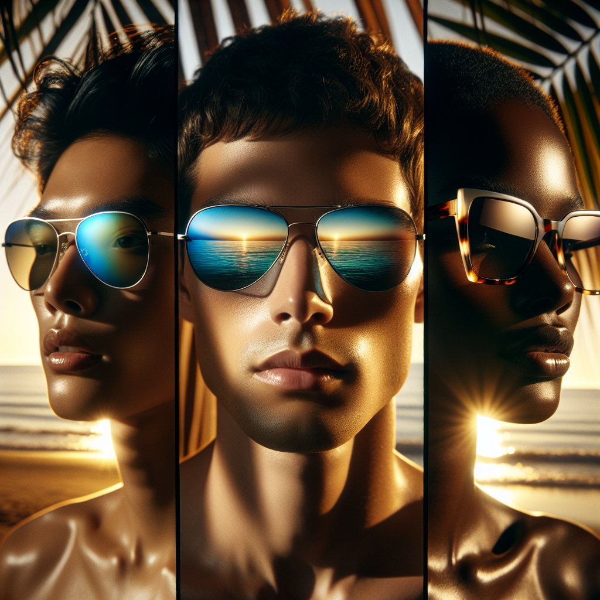

# 🕶️ Summer Sunglasses Campaign – Executive Summary

## 📊 Refined Trend Insights
Summer 2026 Trend Executive Summary

1. Summer 2026 Trend Landscape  
   • Oversized Statement Silhouettes – Dramatic butterfly and mask shapes are commanding attention, creating unmistakable brand presence.  
   • Modern Metal Refinement – Slim aviators and double-bridge pilot frames in polished metal with subtle gradient lenses deliver a sleek, contemporary aesthetic.  
   • Vintage-Inspired Revival – Clean-lined squares and sculptural cat-eyes merge nostalgic appeal with updated finishes for a fresh yet familiar look.

2. Strategic Product Selections  
   • SG001 “Aviator”  
     – Precision-engineered slim-metal frame with teardrop lenses for maximum coverage and a weightless feel.  
     – Aligns perfectly with the polished-metal trend and supports all-day comfort in active summer settings.  
   • SG003 “Mystique”  
     – Sculptural cat-eye profile with a refined upsweep, capturing runway-driven femininity and architectural flair.  
     – Bridges retro inspiration and forward-looking design to appeal to style-conscious consumers.  
   • SG002 “Wayfarer” (Optional)  
     – Bold, square acetate frame evoking ’90s nostalgia while maintaining a modern, statement-making edge.  
     – Extends our appeal to customers seeking non-metal alternatives without compromising trend relevance.

3. Campaign Alignment and Impact  
   • Maximize Reach: Combining metal and acetate frames addresses diverse consumer preferences—from minimalist polish to vibrant boldness—ensuring broad market penetration.  
   • Enhance Engagement: Oversized and sculptural silhouettes create visual impact across digital and in-store displays, driving higher engagement and recall.  
   • Reinforce Positioning: These curated styles reinforce our brand’s commitment to delivering both timeless classics and innovative designs, solidifying leadership in the premium eyewear segment.

By spotlighting these three key styles, we present a tightly focused summer collection that resonates with both traditional and avant-garde audiences, accelerates sales momentum, and elevates our brand narrative.

## 🎯 Campaign Visual

    

## ✍️ Campaign Quote
Elevate Your Summer: Aviators, Cat-Eyes & Wayfarers in Sunset Glow

## ✅ Why This Works
This phrase captures the warm, beachside sunset reflected in sleek metal aviators, sculptural cat-eyes and bold acetate wayfarers—mirroring the image’s glow and aligning perfectly with 2026’s top trends of statement silhouettes and modern retro revivals.

---

*Report generated on 2026-04-06*
