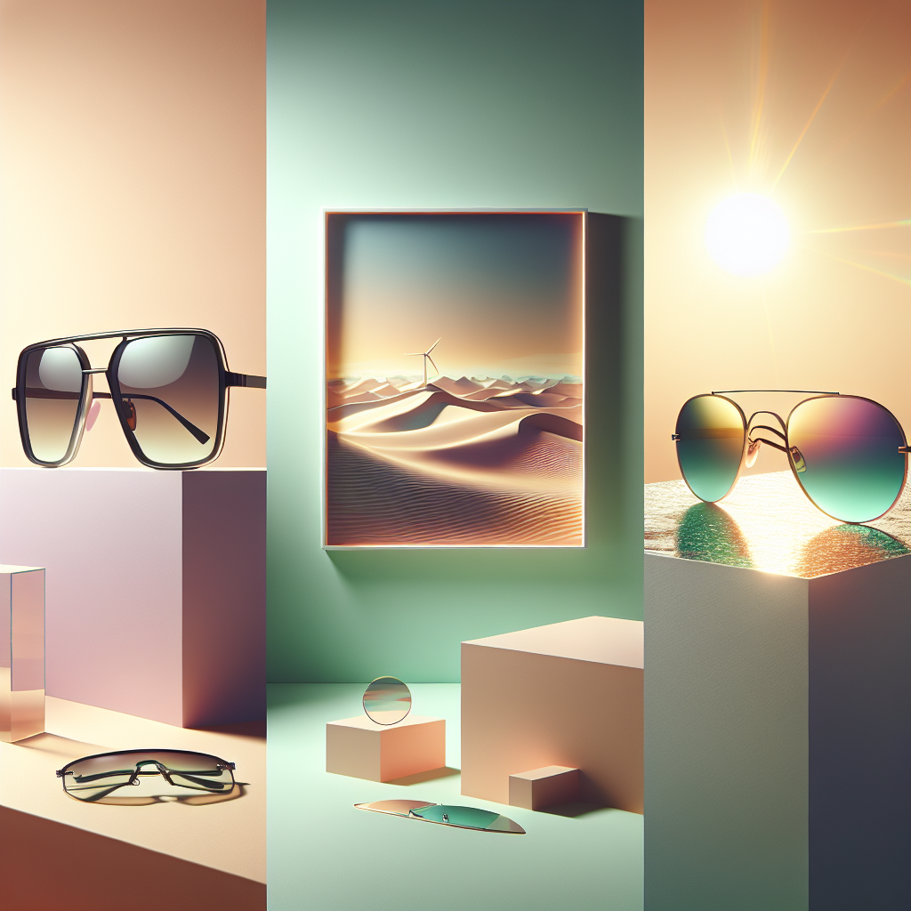

# 🕶️ Summer Sunglasses Campaign – Executive Summary

## 📊 Refined Trend Insights
Executive Summary  
As we gear up for Spring/Summer 2026, three distinct eyewear trends promise to drive consumer interest and sales: bold retro silhouettes, refined aviators, and futuristic sport styles. By strategically spotlighting each in our summer campaign, we’ll capture attention, differentiate our portfolio, and engage diverse customer segments.

Trend Overview  
1. Oversized Retro Frames  
   – Thick acetate, angular edges evoke a nostalgic yet contemporary statement.  
   – High-impact silhouettes perfect for limited-edition drops and social buzz.  
2. Streamlined Aviators  
   – Slim metal temples and neutral-toned lenses deliver timeless appeal and all-day comfort.  
   – Broad cross-generational resonance makes it an evergreen bestseller.  
3. Futuristic Sport Styles  
   – Single-lens wraparounds with prism or neon accents project energy and innovation.  
   – Appeals to performance-minded, trend-driven consumers.

Product Recommendations  
• SG002 “Wayfarer” – Embodies the oversized-retro trend. With only six units in stock, a targeted, limited-edition summer release will generate urgency and excitement.  
• SG001 “Aviator” – Aligns seamlessly with the vintage-aviator revival. Its lightweight design ensures comfort and repeat purchase across age groups.  
• SG004 “Sport” – Delivers on the futuristic narrative. Introducing neon or mirrored lenses can further electrify this segment.

Strategic Rationale  
• Comprehensive Trend Coverage: Bold, classic, and forward-looking styles deliver a unified yet diversified campaign.  
• Differentiation & Scarcity: Limited Wayfarers and colored-lens sports models will create consumer FOMO and PR opportunities.  
• Broad Market Appeal: From fashion-first to performance-driven customers, our lineup spans every key demographic.

Action Plan  
1. Launch themed content series—“Oversized Revival,” “Timeless Teardrop,” “Future Sport”—across social channels and e-mail.  
2. Execute a capsule drop of SG004 with vibrant lenses to maximize the futuristic angle.  
3. Track real-time sell-through and engagement metrics to optimize promotions and inventory allocation throughout the season.

## 🎯 Campaign Visual

    

## ✍️ Campaign Quote
Embrace Summer’s Spectrum: Retro, Timeless, Futuristic Shades

## ✅ Why This Works
This phrase highlights the image’s triptych of bold oversized frames, classic aviators, and sporty futuristic lenses—perfectly capturing the Spring/Summer 2026 trends in a single, elegant line.

---

*Report generated on 2026-04-06*
